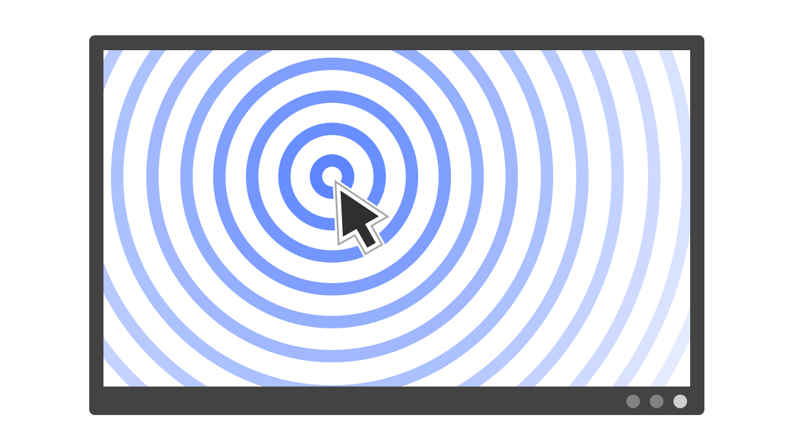
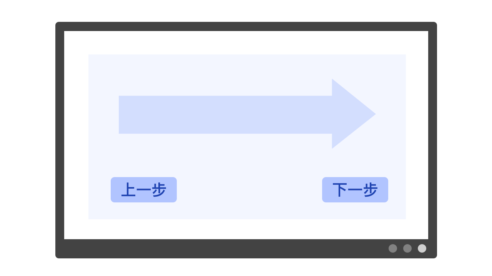
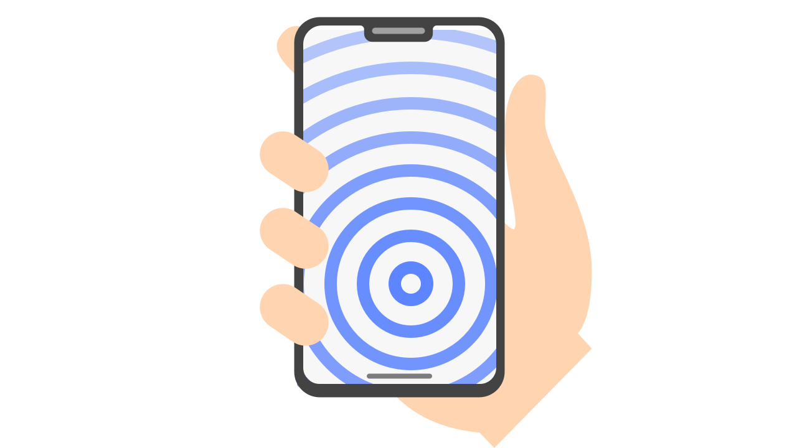
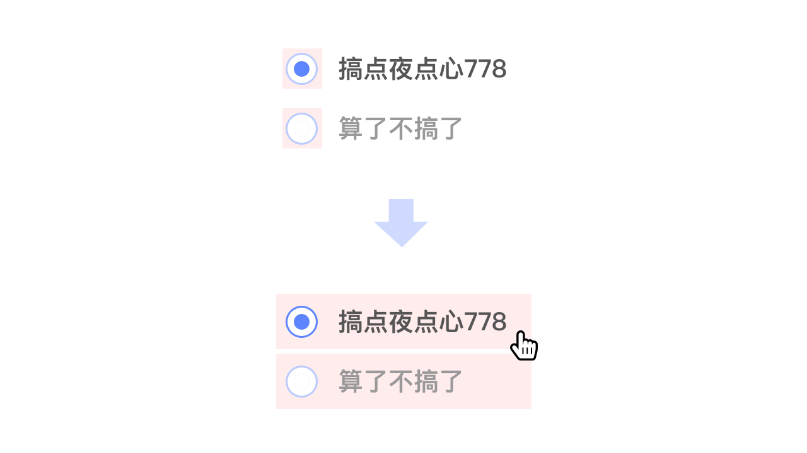

# 交互夜点心：Fitt's Law

今天的夜点心关于交互设计中的 Fitt's Law。

我们会不定期地发布一些交互设计与数据可视化方面的内容，一方面是由于笔者自己在硕士阶段学习的是设计，另一方面前端是直接与 UI 界面打交道的工作，在关注数据逻辑的同时掌握一些设计相关的基本知识总是有好处的。

交互设计的一个很主要的目标就是帮助用户提升交互的效率，即让用户「快速」，「准确」地实现他的交互行为。「快速」意味着降低用户的决策成本和响应时间，「准确」意味着减少用户的犯错概率。为了达成这些目标，有一系列的交互设计原则被提出。今天要介绍的 Fitt's Law 便是其中之一，由美国心理学家 Paul Fitts 于 1954 年提出，主要关于用户的响应时间：

> 越大越近的目标越易触达，越小越远的目标越难触达

这里的目标指的是任意可交互的装置，可以是具有实体的汽车油门踏板、电源按钮，也可以是虚拟的网页按钮、网页表单等。

在 Fitt 的基础上，学者还归纳出了触达时间关于目标大小和距离的公式：

[//]: # ($ \text{MT} = a + b\cdot\log_{2}{\frac{2D}{W}} $)

其中 MT (movement time) 是平均移动时长，a 和 b 是视场景而定的常量，D 是目标相对始发位置的距离，W 是目标的大小。

这个公式是基于交互实验数据拟合得到的，关于它的有效性存在一些争议，一些重复实验的数据难以很好地服从该公式。难以复现的一个重要的原因在于交互实验有太多不可控的来自人和环境因素的干扰，因而对于我们而言，还是更多地把这个公式当成一个抽象的描述即可。

Fitt's Law 也许看起来很简单很显然，但是实际运用到交互设计中时，我们需要把多方面的因素纳入设计的考量之中：

## 距离

在 UI 界面上，距离的度量方式并不一定是欧式距离，也不是绝对的，它受到很多因素的影响，包括但不限于：

- 当前的鼠标位置：以 PC 界面为例，距离最近的位置就是当前鼠标所在的位置，我们常用的鼠标右键菜单就被设计成出现在鼠标的右下方。与之相对的，屏幕的四角大概率是距离鼠标最远的位置，故而一般放置一些低频且错误代价较大的交互需求，比如Mac 的「触发角」所支持的都是一些极低频的交互动作如锁屏等。

- 阅读顺序：东亚和西方国家的阅读顺序都是自左向右，倾向于左侧代表过去，右侧代表未来的顺序，因而一般「上一步」按钮在左，「下一步」按钮在右。如果他们的位置对调则会产生「逆行」，使两者的距离感受都变长。而这种情形可能对于习惯自右向左阅读的阿拉伯世界会有所不同，当然对于古代诗人李白也会不同。

- 手持设备上的距离：对手持移动设备而言，以右手拇指位置为原点的极坐标也许更适合用来度量距离。所以一般屏幕正下部是距离最近的位置，左上角的距离最远，右下角的距离其实也不近。

## 大小

与响应时间相关的大小，并不完全取决于「显示区域」的大小。以一个 radio 组件为例，用户看到的可交互区域只有一个小圆圈那么大。但通过把 label 文案也设置成可点击的区域，我们就扩大了这个 radio 组件的「可交互区域」或「热区」，用户也能更快地触达它。

- 热区不是越大越好：热区和显示区域的大小需要匹配，不必要的热区可能增加用户操作的犯错概率。
- 通过反馈来标示标识热区：热区需要通过交互反馈来让用户确信它的存在，增加用户的操作安全感。比如对 CSS 的 `:hover`, `:focus`, `:active` 等伪类进行背景色变化设置，通过 `cursor` 的配置来反馈热区的语义，通过 `transition` 来柔化上述的响应等等。很多时候交互/UI设计师给出的设计稿并不会细致到每个热区，所以就需要前端工程师来把控他们，让产品获得更极致的用户体验。

以上就是 Fitt's Law 相关的内容，希望能让你在跟产品和设计 PK 的时候获得更足的底气，更重要的是，PK 完了一起产出更用户友好的产品。

## 扩展阅读

[Fitt's Law - Wikipedia](https://en.wikipedia.org/wiki/Fitts%27s_law)
[Fitt's Law - Laws of UX](https://lawsofux.com/fittss-law)
