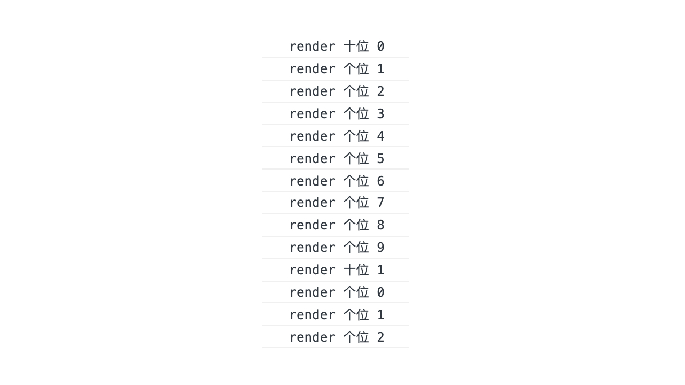
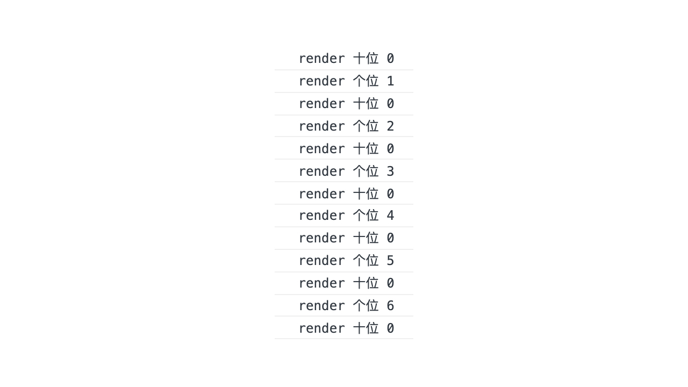

# React 夜点心：memo

今天的夜点心关于 React 的 `memo` 方法。

先来看下面的微微微型应用，这个应用从 1 开始数数，每隔 1 秒加 1，并把当前数值的十位数和个位数通过一个名为 `Display` 的子组件渲染在页面上：

``` jsx
import React, { Component, PureComponent, useState, useEffect } from 'react';
import ReactDOM from 'react-dom';

class Displayer extends PureComponent {
  render() {
    const { name, value } = this.props;
    console.log(`render ${name} ${value}`);
    return (
      <div>
        <label>{name}</label>
        <span>{value}</span>
      </div>
    )
  }
}

const App = () => {
  const [count, setCount] = useState(0);

  useEffect(() => {
    const timer = setInterval(() => setCount(prev => prev + 1), 1000);
    return () => clearInterval(timer);
  }, []);

  return (
    <div>
      <DisplayerFC name="十位" value={Math.floor(count / 10)} />
      <DisplayerFC name="个位" value={count % 10} />
    </div>
  )
}

ReactDOM.render(App, document.getElementById('#app'));
```

上面的代码中，App 组件是应用的根组件；Display 接受一个字符串 `name` 和一个数字 `value` 作为属性，每次组件重渲染的时候会在控台打印出这两个属性的值。

由于使用了 `PureComponent`，我们可以在控台看到用来展示十位的 Display 组件只在数值的十位数变更时进行了渲染，符合预期：



现在我们把 Display 组件重写为一个函数组件：

``` jsx
const Displayer = ({ name, value }) => {
  const { name, value } = this.props;
  console.log(`render ${name} ${value}`);
  return (
    <div>
      <label>{name}</label>
      <span>{value}</span>
    </div>
  )
}
```

重启应用，再看控台：



这次，用来显示十位数的组件每次都跟着父组件一起重新渲染了，跟笔者最初的预期有些不同。React 的函数组件默认不会根据传入的 props 是否变化选择跳过渲染，以获得对可变数据流的兼容性，这在 Display 组件的计算开销非常大时会带来一些性能问题。更主要的是，看到它做了那么多无畏的渲染，会让作为开发者的我们心理很不舒服。随着 Hooks 的推广，越来越多的组件改用函数组件来实现了，该如何来改善这个性能问题呢？

这不，React 从 16.6 开始支持的 `memo` 函数就可以帮到我们：

``` tsx
import { memo } from 'react';
const MemoizedDislay = memo(Display);
```

只要通过 `memo` 函数包裹一个现成的组件（类组件或者函数组件都可以），就可以实现类似 `PureComponent` 的渲染控制效果，减少不必要的渲染。其实 `memo` 函数很简单，你可以自己尝试手动实现它，只要记得在比较每个 prop 是否相等的时候使用 `Object.is` 。

最后，`memo` 函数支持自定义重渲染规则，你可以通过第二个参数传入一个 `compare` 函数，告诉 `memo` 你希望在什么情况下触发组件的重渲染，`compare` 函数具有如下的类型结构，入参上次的 props 和当前的 props，出参一个布尔值：

``` ts
interface Compare {
  (oldProps: Props, newProps: Props): boolean,
}
```

以上就是 `React.memo` 的相关内容。一般来说，只要你的应用大致遵循 immutable 的数据流，就基本可以在所有的组件上应用这个函数来改善应用的渲染性能和你的心情。

## 扩展阅读

- [React.memo 源码](https://github.com/facebook/react/blob/master/packages/react/src/memo.js)
- [React.memo() for Functional Components Rendering Control](https://scotch.io/tutorials/react-166-reactmemo-for-functional-components-rendering-control)
