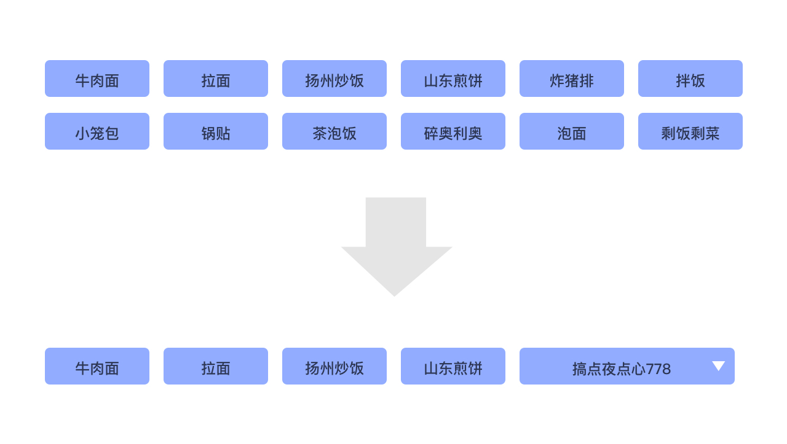
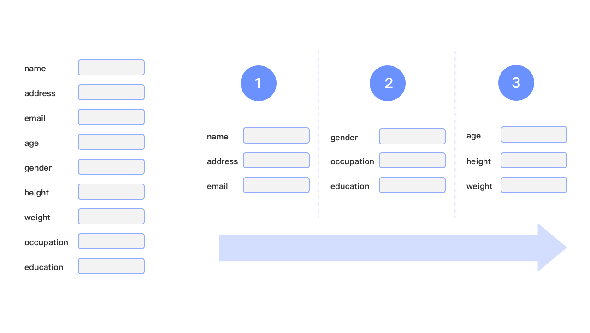

# 交互夜点心：Hick's Law

今天的夜点心关于交互设计中的 Hick's Law

首先让我们回顾一下 [交互夜点心：Fitts' Law](../5/README/md) 中介绍的 Fitts' Law，它讨论的是目标元素的大小和远近对触达速度的影响：

> 越大越近的目标越易触达，越小越远的目标越难触达

今天我们要提到的 Hick's Law 也关于用户的响应速度的，由英国和美国的心理学家 Hick 和 Heyman 与 1951 年左右提出：

> 选项越多，人们选择的时间越慢

这里的选项一般也被称作刺激物（stimulus）可以是一些实体的按钮，可以是格斗中的招式（Hick's Law 也被用在格斗中，一些理论认为太多的招式积累会减慢一个招式的反应启动速度），可以是一份菜单，可以是一张待填充的网页表单。

与 Fitt's Law 类似，它也有一个公式来度量这种响应速度：

<!-- $ T=b\cdot \log _{{2}}(n+1) $ -->

这个公式中的常量 b 是一个常量，n 是刺激物的个数，表明了随着刺激物数量的增多，人的响应速度会以对数速度增长。这个公式是 Hick 和 Heyman 通过一个亮灯实验得到的，他们在被试者面前放置一些贴了名字的灯泡，随机亮起一个灯泡，要求被试者以最快速度说出亮起的灯泡的名字并度量亮灯与说出名字之间的时差作为响应时间。

## 成立条件

Hick's Law 看起来非常简单，但是要准确的理解他和运用他还是需要纳入对相当多的因素的理解。仅在下面的条件成立的情形下，上述的对数增常才成立

### 用户对自己的选择已经有数

人必须对自己要面临的选项有概念，清楚要选择哪一个时选择时间才会服从对数规律。

比如格斗中的出招，格斗者对自己应该使出哪一招来抵挡对手的进攻其实是有数的；又比如网页菜单的选择，用户对大概在检索查找一个怎样的菜单是有概念的。

相反的，在一个高档餐厅通过菜单选择菜品的决策时间就不能通过这种方式进行估算。

### 刺激物的权重应该相似

刺激物的权重需要相似，不然 Hick's Law 的指数曲线会不成立。因为结合 Fitts' Law 我们可以知道，更强烈刺激物会带来更快的反应速度。

其实权重相似的要求与信息论中的信息熵有着密切的关系。熟悉信息熵（香农熵）的同学应该会注意到 Hick's Law 的公式的后半部分与等概率分布情况下的香农熵有些许相似之处：

<!-- $ T=b\cdot H $
where
$ H=\sum frac{1}{n}\log_{{2}}(frac{1}{n} +1) $ -->

### 与有序性的关系

对于很长的列表选项，有序列表的查找时间会更符合 Hick's Law 的对数增常特性，这是因为对有序的列表，例如按照字母顺序排序的美国州名，人们会自然地使用二分法或三分法的方式进行查找，因而于计算机程序类似，具有 O(log(n)) 的时间复杂度；而随机顺序的列表的查找时间会更趋于线性增长，类似与计算机中的遍及查找的时间复杂度 O(n)。所以如果一个列表不得不很别长时，记得让他的项目以按照某种用户很容易识别的顺序排列。

## 应用在交互设计和开发中

应用在交互设计中，Hick' Law 告诉我们应该通过层级的组合来缩短用户对相对更重要的选项的响应时间，让用户更快地获得阶段性的成就感，好过让用户在一个阶段花费大量时间试图一步到位：

例如可以将过长的菜单列表进行部分折叠：

将过长的表单进行步骤化：

最后，决定哪些菜单应该被折叠，哪些应该被展开再更高的层级不是一件很容易的事情。这时可以通过买点上报计算点击率和转化率的方式来决定应该怎么排列才最合理，而埋点就又是我们前端的事了。

## 扩展阅读

- [Redefining Hick's Law](https://www.smashingmagazine.com/2012/02/redefining-hicks-law/)
